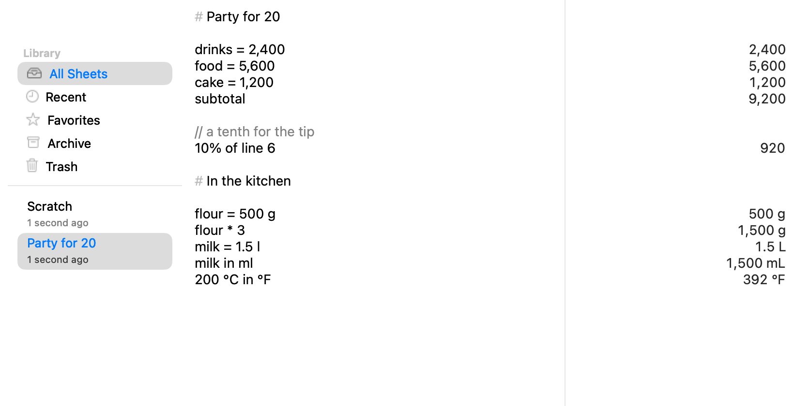
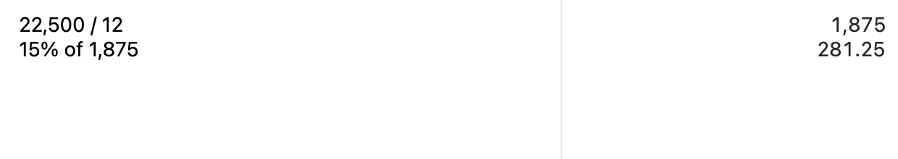
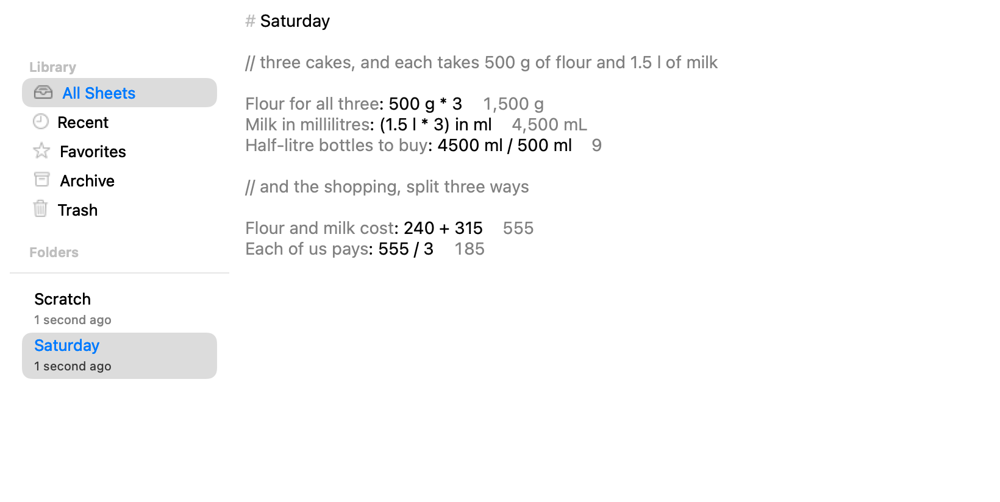
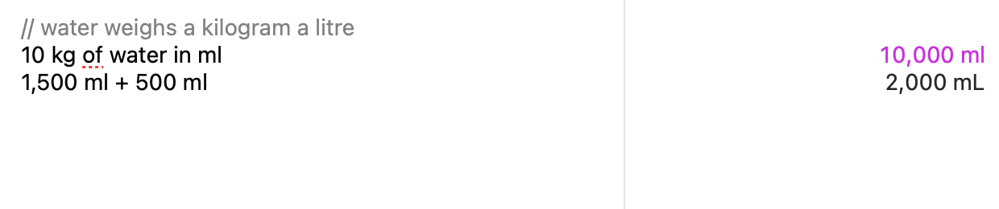

# Ganit

A calculator you write in. Type a line, read its answer beside it, and keep the
whole page — the workings as well as the total.



## What it does

- **Writes like a note.** Name things (`drinks = 2,400`), refer back to them,
  add a `subtotal`, and leave `// notes` and `# headings` where you need them.
  Change one number and every line that depends on it follows.
- **Knows what things are.** Lengths, areas, volumes, mass, temperature,
  duration, data, and money: `1.5 l in ml`, `200 °C in °F`, `9 in in cm`.
  Currencies convert with the European Central Bank's daily reference rates,
  which Ganit downloads at most once a day and you can turn off.
- **Is exact where exactness exists.** Integers, fractions, decimals, and money
  keep their exact value; **Copy Full Precision** gives you all of it.
- **Keeps your sheets.** Plain text on your Mac, saved as you type, with
  backups, Trash, folders, favourites, and export to CSV, HTML, PDF, or print.
- **Answers without being opened.** A shortcut of your choosing summons Quick
  Ganit over any app, Ganit can stay in the menu bar, and the same engine
  answers through a Services item, a Shortcuts action, `ganit://` links, and a
  `ganit` command.
- **Tells the truth.** Anything Ganit cannot work out says so, in place, and
  never quietly guesses.

## Install

Ganit needs macOS 14 or later on Apple silicon.

1. Download the disk image from [the latest release](https://github.com/shantanugoel/ganit/releases/latest).
2. Open it and drag **Ganit** to **Applications**.

Or build it yourself, which needs the Xcode version in
[`.xcode-version`](.xcode-version):

```bash
git clone https://github.com/shantanugoel/ganit.git
cd ganit
./scripts/build-app.sh
open .build/app/release/Ganit.app
```

## Using it

Write one calculation to a line. The answer appears on the right as you type.

| Write | Get |
|---|---|
| `20% off 85` | `68` |
| `rent = 2,100` then `rent * 12` | `25,200` |
| `1.5 l in ml` | `1,500 mL` |
| `200 °C in °F` | `392 °F` |
| `subtotal` | the lines above it, added |
| `10% of line 6` | a tenth of line 6's answer |

The [grammar reference](docs/public/grammar-reference.md) has the rest:
percentages, dates and times, rates, finance, and the functions.

**Quick Ganit** is the same calculator without a window to open. Give it a
shortcut in **Window ▸ Quick Ganit Shortcut…**, and it appears anywhere, over
anything.



**Prose mode** (**Format ▸ Prose Mode**) moves the answers into the lines, for
a sheet that reads as an explanation rather than a column of sums.



**Scratch** (⇧⌘S) is the sheet that is always there, for a number you want to
work out now and name later.

### An assistant, if you want one

Some fair questions are not arithmetic Ganit knows. Under **Ganit ▸
Assistant…** you can name a model — one on the internet, or one running on your
own Mac — and Ganit will ask it about the lines it could not work out, one line
at a time, and mark its answers as its own.



It is off until you set it up. See [the assistant](docs/editor/assistant.md).

### From the command line

The app carries the same engine as a small command:

```bash
/Applications/Ganit.app/Contents/Helpers/ganit '20% off 85'   # 68
printf 'rent = 2,100\nrent * 12\n' | /Applications/Ganit.app/Contents/Helpers/ganit
```

## Your calculations stay yours

No account, no analytics, no crash upload, no tracking. Sheets live in Ganit's
own sandbox container and are never synced anywhere. The only things Ganit
sends are the daily exchange rates it fetches from a fixed address, and, if you
set one up, the single line you asked an assistant about. See
[privacy](docs/public/privacy.md).

## More

- [Grammar reference](docs/public/grammar-reference.md)
- [Privacy](docs/public/privacy.md)
- [Data sources and attribution](docs/public/data-sources.md)
- [Known limitations](docs/reference/known-limitations.md)
- [Recovering your sheets](docs/storage/recovery-guide.md)
- [How answers are checked](docs/public/corpus-highlights.md) and
  [how speed is measured](docs/public/performance-methodology.md)
- [Architecture decisions](docs/adr/README.md),
  [`PLAN.md`](PLAN.md), and [`CONTRIBUTING.md`](CONTRIBUTING.md) for how it is
  built and how to work on it

## License

No open-source license has been selected. See [`LICENSE.md`](LICENSE.md) for
the current placeholder.
