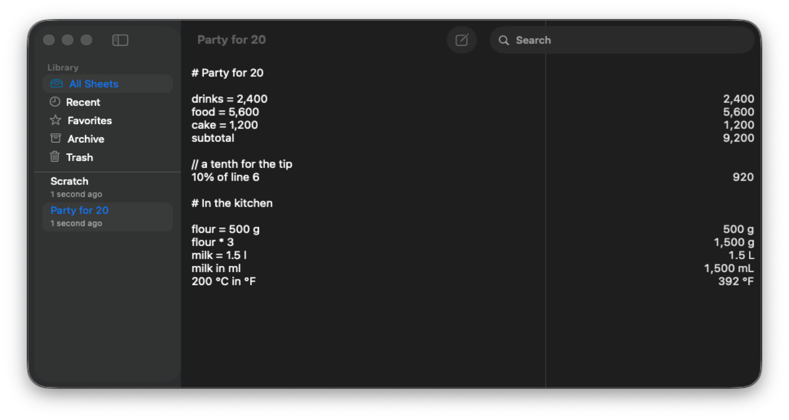
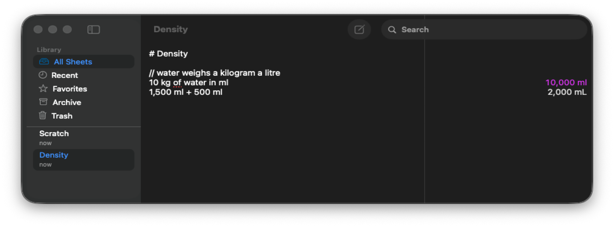
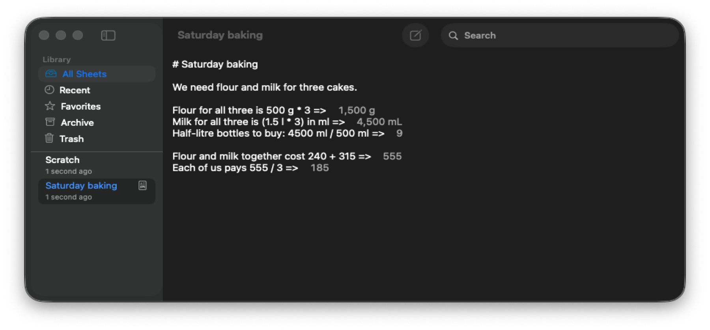
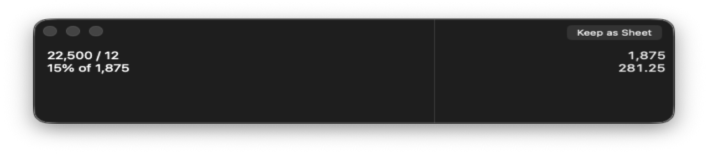

# Ganit

A notepad calculator for Mac. Type a line, get the answer, keep the working.

The live notepad of [Soulver](https://soulver.app/) and [Numi](https://numi.app/), the Markdown sheets of [Calca](https://calca.io/) — plus an optional **AI assistant**, **exact** arithmetic, and answers that **never quietly guess**.

`brew install --cask shantanugoel/ganit/ganit` · [Download for Mac](https://github.com/shantanugoel/ganit/releases/latest) · Apple silicon · macOS 14+

<p align="center">
  
</p>

## What it does

- **A note that calculates.** Name amounts (`drinks = 2,400`), add a `subtotal`, write `10% of line 6`. Change one number and every line that depends on it follows. `// notes` and `# headings` stay put.
- **Units, money, and dates.** `1.5 l in ml`, `200 °C in °F`, `100 USD in EUR`. Currencies use the ECB's daily rates (cached once a day; you can turn them off).
- **Exact when it can be.** Integers, fractions, and money keep their true value. **Copy Full Precision** gives you all of it.
- **An AI assistant for the rest.** Arithmetic cannot do `10 kg of water in ml`. Name a model — on this Mac or on the internet — and Ganit asks it about those lines, one at a time, and marks the answers as the assistant's. Off until you set it up.

<p align="center">
  
</p>

- **Markdown Mode.** Answers move into the line so a sheet reads as an article. `Flour for all three is 500 g * 3 =>` puts the answer right after `=>`, as in Calca.

<p align="center">
   in the lines" width="860">
</p>

- **Anywhere on the Mac.** A shortcut summons **Quick Ganit** over any app. The same engine answers from the menu bar, Services, Shortcuts, `ganit://` links, and a `ganit` command.
- **Yours, and honest.** Sheets are plain text on this Mac: autosave, backups, folders, Trash, export to CSV, HTML, PDF, or print. No account, no analytics. If Ganit cannot work a line out, it says so in place.

## Install

Ganit needs macOS 14 or later on Apple silicon.

With [Homebrew](https://brew.sh):

```bash
brew install --cask shantanugoel/ganit/ganit
```

This installs **Ganit** in **Applications** and puts the `ganit` command on
your path. The cask lives in Ganit's own tap,
[shantanugoel/homebrew-ganit](https://github.com/shantanugoel/homebrew-ganit),
and each release updates it. Ganit updates itself, and `brew upgrade` works too.

Or download it:

1. Download the disk image from [the latest release](https://github.com/shantanugoel/ganit/releases/latest).
2. Open it and drag **Ganit** to **Applications**.

Or build it yourself, which needs the Xcode version in
[`.xcode-version`](.xcode-version):

```bash
git clone https://github.com/shantanugoel/ganit.git
cd ganit
./scripts/build-app.sh
open .build/app/release/Ganit.app
```

## Using it

Write one calculation to a line. The answer appears on the right as you type.

| Write | Get |
|---|---|
| `20% off 85` | `68` |
| `rent = 2,100` then `rent * 12` | `25,200` |
| `1.5 l in ml` | `1,500 mL` |
| `200 °C in °F` | `392 °F` |
| `subtotal` | the lines above it, added |
| `10% of line 6` | a tenth of line 6's answer |

**Help ▸ Ganit Help** is the same list, searchable, in the app. The [grammar reference](docs/public/grammar-reference.md) has the rest:
percentages, dates and times, rates, finance, and the functions.

**Quick Ganit** is the same calculator without a window to open. Give it a
shortcut in **Window ▸ Quick Ganit Shortcut…**, and it appears anywhere, over
anything.

<p align="center">
  
</p>

**Markdown mode** (**Format ▸ Markdown Mode**, or the sheet's right-click menu)
moves the answers into the lines, as in Calca. Headings, paragraphs, lists, and
`**bold**` sit beside ordinary Ganit arithmetic. A line shows its answer when
it ends its calculation with `=>` (⌘↩ adds one), right after the arrow, and any
words after the arrow follow the answer. Markdown sheets show a small document
mark in the sidebar.

**Your own functions**: `area(w, h) = w * h` defines one, and `area(3 m, 4 m)`
calls it. Put it in **Window ▸ Definitions** to use it in every sheet.

**Scratch** (⇧⌘S) is the sheet that is always there, for a number you want to
work out now and name later.

### An assistant, if you want one

Under **Ganit ▸ Assistant…** you name any OpenAI-compatible base —
`https://api.openai.com/v1`, a model on this Mac at
`http://localhost:11434/v1`, or another HTTPS `/v1` — and a model. Ganit
POSTs `chat/completions` under that base. It asks about the lines it could
not work out, one at a time, and marks those answers as the assistant's. It
is off until you set it up. See [the assistant](docs/editor/assistant.md).

### From the command line

The app carries the same engine as a small command. Homebrew puts it on your
path as `ganit`; otherwise it is inside the app:

```bash
/Applications/Ganit.app/Contents/Helpers/ganit '20% off 85'   # 68
/Applications/Ganit.app/Contents/Helpers/ganit 'rent = 2,100' 'rent * 12'
printf 'rent = 2,100\nrent * 12\n' | /Applications/Ganit.app/Contents/Helpers/ganit
```

## Your calculations stay yours

No account, no analytics, no crash upload, no tracking. Sheets live in Ganit's
own sandbox container and are never synced anywhere. The only things Ganit
sends are the daily exchange rates it fetches from a fixed address, and, if you
set one up, the single line you asked an assistant about. See
[privacy](docs/public/privacy.md).

## More

- [Grammar reference](docs/public/grammar-reference.md)
- [Privacy](docs/public/privacy.md)
- [Data sources and attribution](docs/public/data-sources.md)
- [Known limitations](docs/reference/known-limitations.md)
- [Recovering your sheets](docs/storage/recovery-guide.md)
- [How answers are checked](docs/public/corpus-highlights.md) and
  [how speed is measured](docs/public/performance-methodology.md)
- [Architecture decisions](docs/adr/README.md),
  [`PLAN.md`](PLAN.md), and [`CONTRIBUTING.md`](CONTRIBUTING.md) for how it is
  built and how to work on it

## License

No open-source license has been selected. See [`LICENSE.md`](LICENSE.md) for
the current placeholder.
