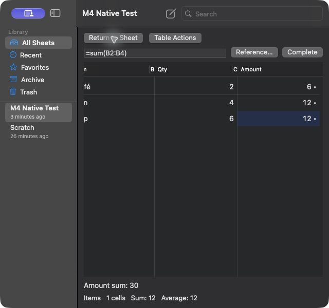

# M4 expanded editor test report

Date: 2026-10-04. Branch: `tables`. Worktree:
`/Users/shantanugoel/.codex/worktrees/tables-m0/ganit`.
Starting commit: `dee61dc85cc997dc0ecebdd871dd0b1e4b223a8a`.

## Task commits

Each task had a basic check before its commit.

| Task | Commit | Basic check |
|---|---|---|
| 1. Reused AppKit grid and source projection | `1e5bc37` | Debug build |
| 2. Selection, native input and shared Undo | `6171c62` | 10 source coordinator tests |
| 3. Reference picking, range dragging and completion | `6e65154` | Debug build |
| 4. Rules, structure, clipboard, fill and totals | `4eb26cc` | 26 transformation tests |
| 5. Interpretation, repair, failure navigation and Pending | `9ff10d3` | Debug build |
| 6. Table entry, return and state restoration | `005b853` | Debug build |

## Review corrections

Commit `e7be946` contains the review corrections and regression tests.

Review and native app tests found and corrected these defects:

- The toolbar covered the top controls. The grid now uses the safe area and
  two control rows. Controls remain visible in a narrow window.
- A reference click moved focus from the formula field. The grid now keeps
  field focus during an edit.
- Native range dragging inserted only the first address. The grid now tracks
  AppKit drag events. Deferred field notifications preserve the picked range.
- Structural edits could move a selection to another identity. Selection now
  follows row and column IDs. A stale draft cannot replace changed source.
- Inherited formulas could show the wrong relative row. The field now uses
  the effective formula source for the selected cell.
- Out-of-bounds reference highlights could construct an invalid range.
  Highlight ranges now have checked bounds.
- Reset Overrides could remove ordinary inputs. It now resets rule columns
  only and uses one source edit for the rectangle.
- Interpretation showed internal error codes. It now uses readable error and
  context text. Broken-reference repair selects the full operand.
- Results could remain Pending after a block error. Block errors now show a
  diagnostic. Typed summaries read calculation results directly.

## Automated checks

The final full suite passed 1,056 tests. Formatting and whitespace checks
passed. The release app build, bundle validation and package validation also
passed. The editor regression suite has 16 tests. It covers
reused views for 500 rows, labels, selection, field commit and cancel, marked
input, shared Undo, stale drafts, references, rules, clipboard, totals,
Pending, repair, original-failure navigation and projection synchronization.

An address-sanitizer run passed 26 editor and source coordinator tests. This
run preceded the native drag-event correction. The 16 editor tests passed
again after that correction. Logs:

- `/tmp/ganit-m4-asan.log`
- `/tmp/ganit-m4-tracking-tests.log`
- `/tmp/ganit-m4-complete-tests.log`
- `/tmp/ganit-m4-complete-release.log`
- `/tmp/ganit-m4-complete-bundle.log`

## Native app checks

Computer Use operated the built macOS app. A separate QA app identity and
library preserved the user's existing sheets. The normal app identity met an
existing library startup error. The QA identity allowed tests with new sheets.

The test sheet had `rate = 3` above the Items table. These checks passed:

1. Create a sheet and insert a table through the app menu.
2. Enter a cell with the keyboard and paste a three-row TSV rectangle.
3. Set `=[@Qty] * rate` as the Amount rule. Quantities 2, 4 and 6 produced
   6, 12 and 18. The sum was 36.
4. Pick B2 in an open formula draft. Append `* rate` and commit. The result
   was 6 and the override dot appeared. Undo and redo restored the source.
5. Enter `=1/0`, inspect the error, then use Undo to restore the prior value.
6. Use the real macOS US input dead key to enter Café. Marked input stayed
   in the field. The grid changed after Return. Escape cancelled another draft.
7. Drag from B2 to B4 in `=sum(`. The draft became `=sum(B2:B4`. Complete
   it and commit. The result was 12. Field focus stayed in the draft.
8. Select `sum` from Complete with the keyboard. Use Reference to enter
   B2:B4. Commit the completed formula. The result was 12.
9. Return to prose and reopen the table. The previous cell and formula source
   were restored. The final Amount sum was 30 after the two sum overrides.
10. Add a row through Table Actions. Document Undo restores the prior rows
    and the Amount sum of 30.
11. Inspect the accessibility tree. Controls had labels. Selected rows and
    cell addresses, headers and values were exposed.

## Scope and remaining checks

M4 implementation, review and basic native checks are complete. The user
requested basic VoiceOver testing. Accessibility labels were checked; spoken
VoiceOver task completion was not tested. A real CJK candidate-window test was
not run. Automated Japanese marked-text tests and the real US composition
check do not replace that test. Keep these checks in the release matrix.

The 500-row view test checks reuse. It does not prove full-scale edit latency
or the M6 performance budgets. M5 inline presentation, Find integration and
both sheet-mode checks remain planned work. Storage schema 2 and table block
version 1 remain unchanged.
