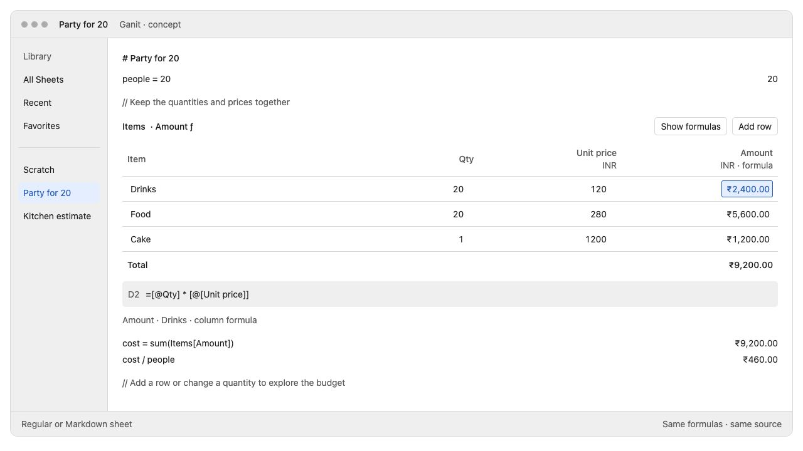
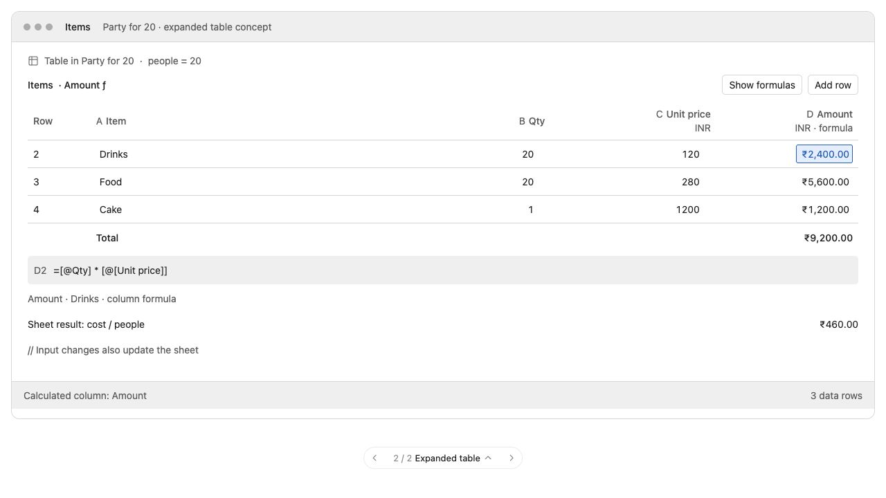

# Calculation tables: implementation plan

Date: 2026-10-01; updated 2026-10-03. Status: M0 feasibility complete with
inline preview/Open Table selected; architectural decisions resolved in ADRs
0016/0017. M1 (source model, identity and safe storage) is complete on branch
`tables`: table block format v1 and metadata/manifest schema 2 are frozen with
fixtures, and its exit evidence passes. M2 is complete (see the execution record and
[engine evidence](../design/tables/m2-engine-evidence.md)). M3 is complete. It implements structural
source edits and table calculation in workspace sheets. The M3 acceptance report
records the [review and test results](../design/tables/m3-integration-evidence.md).
Expanded table editing remains M4 work. This plan refines the [investigation](../design/tables-investigation.md)
and governs its unresolved details for this feature. It does not replace
accepted ADRs; M0 decisions and evidence are linked below.

## Outcome and scope

Add named, bounded calculation tables to regular and Markdown workspace
sheets. Users can keep assumptions above a table, calculate cells and columns
inside it, and refer to its results below. Expanded editing operates on the
same table and shares the document's source and Undo history. A table-first
new-sheet action is a template, not a separate sheet format or engine.

The first release includes typed inputs, formula cells, calculated columns,
A1 and structured references, ranges, row/column addressing, copy/fill locking,
cycle diagnostics, rectangular selection/paste, totals, focused editing and
lossless storage. Inline editing is a gated part of that release: if native
editing gates fail, ship an inline preview plus Open Table, preserving the
same block model. No dates or effort estimate until M0's spikes pass.

Comparisons, lazy `if`, conditional aggregates, lookup and text functions are
a following increment. Destructive sort, filtering, arbitrary forward
references between tables, cross-sheet dependencies, array spills, charts and
`.xlsx` compatibility are outside the first release. Unsupported formulas get
explicit diagnostics, not approximate substitutes.

## Compatibility scope

Backward compatibility is out of scope. Implement one current source/package
format; reject unsupported schema versions clearly. Do not add old-schema
readers, migration/conversion paths, downgrade support, compatibility shims,
migration-specific backups or an older-reader capability-publication barrier.
No byte-for-byte preservation of earlier CLI output is required. This policy
supersedes prior compatibility requirements for the table work and applies to
all milestones and the linked ADRs.

Atomic writes, lossless source storage, malformed-block quarantine, current-
format backups/recovery, and correctness of the supported ordinary calculator
remain required. Version fields identify the current format and detect
unsupported inputs; they do not create an obligation to support past formats.

## Visual references and interaction requirements

The references are saved in the repository and do not depend on this chat:

- [Interactive concept](../design/tables/concept.html): use the bottom picker
  to switch between Within a sheet and Expanded table. Change quantities,
  prices or add a row to explore the fixed calculation rule.
- [Editable reference source and notes](../design/tables/README.md).

### Within a sheet

Preserve the ordinary writing surface around the table. Use quiet dividers,
system fonts, numeric alignment and existing Ganit number formatting. A
selected formula exposes its source and referenced cells. Addresses appear
when useful, rather than making a permanent spreadsheet frame dominate prose.
The block can use the available editor width; the answer-column rule must
not cut through it. Below-table results use the sheet's existing regular or
Markdown answer placement.

### Expanded editing

Use the editor pane for the selected table with stable headers, a compact
formula field and a discoverable Return to Sheet action. Restore the previous
prose cursor, table selection and scroll position. The illustrated formula
field is read-only in the concept; production editing, reference picking,
column-formula controls, error cards and Return to Sheet are required work.

The concept is an interaction/layout reference, not production code, a native
screenshot, a storage-format example or a general formula parser. Its fixed
INR arithmetic, simplified validation and controls do not define engine rules.
Map the visuals to [Ganit's semantic visual system](../design/visual-system.md).

## Contract to implement

### Document and scope

1. Recognize explicitly delimited table blocks before ordinary line syntax
   or Markdown prose classification. Plain Markdown pipe tables stay prose.
2. Preserve physical source-line numbering. Each table source line has no
   ordinary scalar answer: `line N`/`@N` targeting it fails explicitly and
   points to qualified table references instead.
3. Preserve existing top-to-bottom scope, redeclarations, custom-unit/rate/
   function closures and divider resets. Capture the visible scope when the
   table begins. References to later prose or later tables fail in v1.
4. Inside one table, references may point in any direction; graph order,
   rather than row order, determines evaluation. Later tables and ordinary
   lines can read visible earlier tables.
5. Table names are case-insensitively unique within a sheet, even across
   dividers. Dividers reset table visibility along with ordinary local scope.
   Column names are unique within their table. Headers can contain spaces,
   currency names and unit words without becoming variables or units.
6. A table ends the ordinary aggregate block before and after itself without
   resetting variables. Its cells and visual totals never silently join bare
   `sum`, `subtotal` or `previous` in prose. Use qualified references to consume
   them. Inside table formulas, diagnose bare aggregate/`previous` keywords;
   explicit range arguments are required.
7. V1's grid UI is a workspace feature. Definitions remains a declaration
   surface; reject tables there rather than accidentally exporting table
   values globally. Quick Ganit must identify pasted table blocks and offer
   an explicit workspace path or a clear unsupported-view response. It must
   not calculate raw table rows as ordinary lines or lose their source.

### Cell input and values

- Distinguish blank, literal text, typed literal input, formula source,
  inherited column formula and an explicit override. Formula cells start
  with `=`. Empty input is blank, not zero. A blank override is distinguishable
  from clearing an override and inheriting the column rule again.
- Start with explicit text versus value column input policies. Value inputs
  accept complete supported literals: numbers, percentages, money, quantities
  and temporal values. Arithmetic such as `1-2` requires `=`; suggest that fix
  instead of interpreting it as a date or silently switching it to text.
  Column unit/currency defaults affect interpretation and therefore belong in
  canonical source, not just display metadata. Use existing locale policy.
- Keep ordinary scalar values as `EngineValue`. A separate cell/operand layer
  carries text, blank, range views and failures. General string and boolean
  expression support is not required for v1.
- Arithmetic on blank/text is an error. Range `sum`, `average`, `median`,
  `min` and `max` skip blank/text, propagate failed cells and require compatible
  scalar kinds. Preserve exactness, dimensional checks and currency checks;
  require explicit currency conversion. Typed min/max need implementation
  and tests; current numeric-only paths are not automatically sufficient.
- Preserve existing empty numeric `sum` → `0`. An empty typed column can
  produce its declared typed zero when its kind admits an additive zero;
  otherwise diagnose the unsupported aggregation. Empty average/median/min/max
  is an error regardless of column type. Reference failure is never an empty
  range or zero.
- Preserve existing explicit-list `count(...)` semantics. In v1, `count(range)`
  counts nonblank scalar values, including money/units/temporal values, and
  fails on formula errors; text is excluded. Selection shows selected cell
  count separately. Document this Ganit behavior instead of claiming Excel
  COUNT compatibility; a distinct nonblank count can follow later.
- Formatting never changes stored values. Ranges/derived totals must not
  substitute rounded or displayed text into formulas. Carry approximation,
  rounding, currency-rate and clock provenance through dependencies.

### Addressing

These spellings follow the accepted M0 reference contract in ADR 0016;
the production parser and collision corpus are M2 work. Examples assume header row 1, first data row 2.

| Form | Meaning |
| --- | --- |
| `=B2 * C2` | Scalars within the current table |
| `=$B$2`, `=$B2`, `=B$2` | Both, column-only or row-only locking during copy/fill |
| `=sum(B2:D6)` | Rectangular range |
| `=sum(C:C)` | Bounded data column; excludes header and visual totals |
| `=sum(2:2)` | Bounded data row; does not exclude the formula cell if it lies there |
| `=[@Qty] * [@[Unit price]]` | Current row's named columns |
| `=sum(Items[Amount])` | Current data membership of a named column |
| `=Rates!B2`, `=sum(Rates!B2:B8)` | Qualified cells/ranges in a visible earlier table |
| `=sheet[B2]` | Inherited ordinary variable named B2, rather than a cell |
| `cost = sum(Items[Amount])` | Qualified table operand in a later ordinary line |

Reserve `sheet` as a table identifier for the inherited-scope qualifier, not
as a new forbidden ordinary variable name. Outside table formulas, bare `B2`
keeps its current variable meaning; only explicit table-qualified references
enter the added grammar. Add escaping rules for punctuation in headers and
table identifiers. Do not silently reinterpret `$` money, `!` factorial,
time/label `:`, bitwise `|`, `@N`, or completion queries.

In table formulas accept case-insensitive aliases for the supported built-in
function set, so `SUM` and `sum` work alike. Preserve ordinary-sheet dispatch
and existing custom-function naming. Diagnosing bare aggregate keywords must
not reject an inherited variable with that name; `sheet[count]` makes that
intent explicit when it would otherwise be ambiguous.

Scalar header references return text. The totals footer is a summary surface
without a numbered data row; its configuration is persisted, and its operands
read data rows only. Refer to its equivalent named aggregate in prose. A
whole row/column that includes the formula itself is a cycle: never special-
case it by removing the current cell. A1 addresses outside table bounds fail;
there is no infinite worksheet or automatically expanding reference target.

### Structural edit semantics

| Operation | Required behavior |
| --- | --- |
| Edit a value/formula | Keep table/row/column identities; recalculate dependents |
| Insert row/column | Existing scalar references follow targets, including `$` references; insertion strictly inside a rectangular range expands it, insertion before it shifts it, insertion just outside it does not extend it |
| Append a row | Named/whole-column ranges grow; a finite rectangle does not grow merely because a row was appended after it |
| Delete a scalar target | Persist a broken-reference token with original target identity; reuse of its old coordinate cannot repair it |
| Delete inside a rectangle | Remove that membership and shrink surviving bounds; if no referenced data survives, persist a broken range |
| Delete a rectangular endpoint | Surviving included rows/columns become the new bounds; do not accidentally include an adjacent outside row |
| Rename table/column | Rewrite bound source references in the same Undo transaction; ordinary text/comments are untouched |
| Copy/fill formula | Translate unlocked axes from source cell to destination; locked axes stay fixed; out-of-bounds translations become persistent broken references |
| Move formula/cell | Preserve referenced identities; do not apply copy translation |
| Copy table/sheet | Mint appropriate new table/row/column IDs and rebind references internal to the copied set; preserve external references only when their targets remain visible, otherwise mark broken |
| Change column rule | Update inherited cells; preserve and visibly mark per-cell overrides |
| Undo/redo | Restore source, IDs, references and selection as one coherent document edit; then recalculate |

Structured column names stay attached to the same column during v1 copy/fill;
only a current-row qualifier changes its row context. This is a documented
simplification of Excel's structured-reference fill variants. A relative A1
column-rule template is anchored to the first data row and instantiated with
the same copy rules, including newly appended rows. Preserve relative offsets
and locked target identities when inserting/deleting the anchor row; rebase
the template as part of that edit. An empty table retains a virtual row-2
template anchor and instantiates its rule when data is added. Test zero-row,
one-row and first-row insertion/deletion cases explicitly.

Use a versioned Ganit clipboard payload with source origin and formula/input
policy for internal copy/fill; preserve plain TSV as the interoperable fallback.
An arbitrary external formula string has no trustworthy source origin: bind
it at the destination after explicit formula-paste selection. V1 rectangular
move applies within the same table; cross-table moves are deferred until target
qualification and inherited-scope changes have an explicit contract.

V1 has no destructive sort or arbitrary row move. A later sorting increment
must settle the tension between references that follow records and rectangular
ranges before enabling it. View-only sort/filter does not change canonical
address order; ordinary aggregates still include hidden data.

### Identity in source and after reload

Use persistent `TableID`, `RowID` and `ColumnID`; a data-cell identity is their
tuple, avoiding an extra UUID for every cell. Header identities are distinct.
Never use session `LineID` or a physical row index as durable identity.

The versioned block stores readable inputs/formulas, ordered IDs, semantic
column settings, column rules/overrides and a reference-binding ledger. The
ledger associates formula occurrences with target identities and copy flags;
readable A1/name source alone is insufficient to stop deleted references from
rebinding after reload. Successful structural edits rewrite both together.
Broken references are explicitly represented in source, with repair commands.
The exact ledger encoding and broken-marker spelling are M0 decisions.

Anchor table-formula bindings by owning cell/rule identity, not a global text
offset. Ordinary prose references use the existing rewrite-and-persist pattern:
successful table address rewrites and deleted-target markers survive reload
as source. Prose lines do not gain persistent `LineID`s for this feature. M0
must prove both paths, including duplicate formula text in different locations.

Bind a freshly typed/pasted reference to its current address. Reuse persisted
bindings only when their formula-source fingerprint matches. A manually
edited formula invalidates its old bindings; do not attach a stale occurrence
ordinal to different text. Diagnose duplicate IDs, conflicting ledgers and
malformed blocks without mutating their source. New IDs are minted only for
deliberate creation, duplication or an explicit repair, not on every parse.

Lossless parse/serialize preserves untouched UTF-8 text and line endings.
Source commands patch relevant spans; parser recovery retains the complete
malformed/unknown block and stops its body from being evaluated as prose.
Plain source export includes identities/bindings; values-only Markdown/CSV
exports are explicitly lossy presentations.

## Architecture and ownership

Keep the existing module boundaries and deterministic engine. Proposed new
type names below describe responsibilities, not mandatory API names.

| Layer | Work |
| --- | --- |
| `GanitEngine` | Block source map/codec, typed references and range operands, graph evaluation, identities/bindings, structural-edit transformations, table result snapshots |
| `GanitFormatting` | Cell/column formats, range errors, interpretation/provenance, source-reference completions |
| `GanitEditorUI` | Document source-edit coordinator, expanded/inline grid controllers, cell selection, reference picking, summary bar and source-mapped projection |
| `GanitDocuments` | Current-format atomic storage, recovery, backups, export/import and identity remapping |
| `GanitWorkspaceUI` | Insert/Open/Return commands, table-first template, focused-view restoration, title/search integration and multiwindow synchronization |
| `GanitSystemIntegration` / CLI / Quick UI | Shared evaluator and explicit scalar/table output contracts |

Extend the sheet evaluation result with a table-result collection keyed by
identity and source span while retaining per-physical-line results. Refactor
the existing top-to-bottom fold to visit text/table blocks with one live scope
and one physical-line map. Do not evaluate separate text fragments using fresh
`SheetCalculator`s: that loses references, redeclarations and aggregate state.
Keep a fast path and existing cache instrumentation for table-free sheets.

Each table calculator binds references, discovers dependencies, identifies
cycles and evaluates the acyclic graph. Discover references using a dedicated
syntax/binding pass before Ganit's value-kind-directed parse. Defer parsing
percentage/unit phrases until dependency kinds are available. Cache parsed
ASTs by source and operand kinds, outcomes by inputs/context, and range nodes
by membership. Include inherited custom functions and captured dependencies.

Use an iterative graph walk/SCC algorithm with reverse dependencies and
cancellation; recursive 10,000-cell chains must not overflow the stack. Report
cycle participants, blocked dependents and original failing cell addresses.
Independent components still calculate. Recheck missing-reference bindings
when structure changes, so adding a previously missing named column can
repair a fresh unresolved name without reviving a deliberate deleted marker.

Ranges are bounded views over outcomes, with shared membership/dependency
nodes; do not convert a range into thousands of positional function arguments
or repeat its cell-edge set for every reader. One generation uses one clock,
currency-rate snapshot and inherited-scope snapshot. Reuse latest-generation
commit, clock-boundary scheduling and cancellation in the current scheduler.

Move authoritative source-edit orchestration out of `NSTextView` ownership
only as needed. Text and grid edits must pass through the same document Undo,
source update, reference rewrite, autosave and evaluation pipeline. Projections
are derived and never independently saved. Multiwindow updates must refresh
both projections and preserve the existing document conflict policy.

No automatic assistant fallback for table syntax/errors and no per-cell request
fan-out. Keep formula computation local. Any later explicit selected-cell
assistant action follows the existing opt-in behavior and marks provenance.

## Milestones and exit criteria

Each milestone should be a reviewable change or a small series of changes.
Keep unfinished behavior behind a development flag until all v1 gates pass.

### M0 — Close architectural questions with disposable spikes

- [x] Prototype a lossless versioned block plus identity/reference ledger.
      Exercise Unicode, CR/LF/CRLF, quotes, brackets, multi-line text, decimal
      commas and formula `|`. Check size overhead against the 1 MB source limit.
- [x] Prototype a rightward/downward dependency, a cycle with an independent
      valid component, and a 10,000-cell chain using Ganit arithmetic.
- [x] Prototype an expanded native grid edit through document Undo and a
      source-mapped inline preview. Verify automated focus, cross-boundary copy,
      mapped Find selection, marked-text retention and accessibility labels;
      inspect the prototype divider. Choose preview/Open Table. Full native
      task acceptance on the integrated editor remains mandatory in M4/M5.
- [x] Specify reference grammar/escaping, inherited-variable qualifier,
      ledger/broken-marker encoding and exact range transformation rules.
- [x] Resolve ADRs for table semantics/editor ownership and table-source/
      storage. The experimental wire format is frozen only after
      M1 fixtures and validation; architecture acceptance is not a format freeze.

M0 execution evidence is in [the disposable spike report](../../Spikes/TablesM0/evidence.md).
Run instructions, CR/LF/CRLF round-trip fixtures, recovery examples, a native
preview capture and dependency traces are checked in alongside the isolated
`GanitTablesM0` executable. The shipping targets do not depend on it.

[ADR 0016](../adr/0016-table-semantics-and-editor-ownership.md) specifies the
semantics, reference escaping and precise transformation rules. [ADR 0017](../adr/0017-table-source-and-storage.md)
specifies the ledger approach, current metadata/manifest schema 2, and atomic
storage/recovery. Backward compatibility and migration are excluded. Both ADRs
are **accepted architectural decisions**. M1 validated and froze the production
wire format as [table block version 1](../storage/table-blocks.md); the
disposable spike encoding is not a public format. Source byte measurements set a **4,000 populated-cell provisional
ceiling**, independently subject to the existing 1 MB source limit; the engine
still proves a stack-safe 10,000-node chain. M2/M6 must validate the remaining
resource budgets and full edit-to-visible latency.

The explicit editor choice is **inline preview + Open Table**, with expanded
AppKit editing. Automated native field commits, source/Undo/redo, deletion and
disk reload, cross-boundary copy, mapped Find selection, Return focus and
marked-text simulation pass. A derived inline native preview is captured and
source-mapped, and its divider skips the table. Real input-method composition,
VoiceOver task completion, native Find-panel navigation, both sheet modes and
integrated answer placement have **not** been verified. These are mandatory
**M4/M5 acceptance and M6 release gates**, rather than blockers for M1 source
and storage implementation. This explicitly revises the original M0 sequencing:
M0 establishes feasibility and selects the permitted preview fallback; full
editor task verification runs when the integrated editor exists. No unrun test
is marked passed, and release gates are not waived. See the report for the
exact task acceptance runs required. No user decision is needed to begin M1,
and no production schema constants or document files were changed.

**Exit:** round-trip fixture examples, dependency traces, native editing proof,
measured size/latency, and an explicit inline-edit versus preview decision are
recorded. No unresolved semantic question is delegated to incidental UI code.
If inline editing fails, accept the documented preview/Open Table fallback.
If source recovery, exact arithmetic or shared Undo fails, revise the design
before proceeding.

### M1 — Source model, identity and safe storage

- [x] Implement block segmentation, source-coordinate mapping, lossless codec,
      IDs, binding validation and malformed/unsupported-block diagnostics.
- [x] Add frozen fixtures and readers/writers for the single current format:
      metadata/manifest schema 2, as selected in ADR 0017. Reject unsupported
      schemas explicitly; do not add older readers or migration paths.
- [x] Use atomic source/metadata/package writes and retain ordinary current-
      format backups. Test interrupted writes; no migration-specific backup
      or one-time capability barrier is required.
- [x] Recover missing/corrupt metadata in the current schema from canonical
      source without losing IDs, bindings or malformed blocks. Unknown table
      versions must stay quarantined from ordinary calculations.
- [x] Support current-format package import/export and exact plain-source
      import/export. Do not add downgrade export or schema conversion.
- [x] Make malformed tables retainable/saveable without source loss; editing
      must not replace an invalid table with the last valid projection.

**Exit:** interrupted atomic writes preserve a complete committed source.
IDs, broken references and formulas survive current-format save/reload,
plain-source recovery, current-format backup restore and corruption drills.
Current-format fixtures load; unsupported schemas are rejected explicitly.
No older-format reader, upgrade/downgrade or migration rollback is required.

### M2 — Formula grammar, graph and typed range operations

- [x] Add scoped AST/reference forms, bindings, inherited-scope reads and
      typed cell/range operands. Verify supported ordinary syntax and arithmetic
      alongside table formulas; no separate legacy parser or evaluator path.
- [x] Implement iterative graph evaluation, SCC diagnostics, blocked-result
      propagation, cycle paths and original-cause source ranges.
- [x] Implement range aggregates, empty/type/error rules, whole-row/column
      bounds and data-only named membership; audit typed min/max explicitly.
- [x] Reuse exact arithmetic, conversions, functions, rate/clock context and
      provenance. Diagnose unsupported/bare table functions explicitly.
- [x] Add dependency invalidation, range-membership invalidation and resource
      limits. Start with M0's provisional per-sheet 4,000 populated cells,
      100,000 dependency links and 1,000,000 range-cell visits per generation;
      validate/tune these in M0/M6. Keep the existing 1 MB source limit and
      arithmetic/syntax limits. Diagnose limits; never truncate calculation.
      Bound total scalar operations per table generation as well as per cell,
      so many individually legal heavy formulas cannot evade the work budget.

**Exit:** engine/corpus cases cover references in every direction, exact
money/units, compatible/incompatible ranges, empty inputs, dynamic column
membership, cycles and independent results. A 10,000-cell chain is stack-safe;
an edit invalidates the necessary dependents without reparsing unrelated cells.

### M3 — Structural edits and mixed-sheet evaluation

- [x] Implement pure source transformations for creation, insertion/deletion,
      rename, formula copy/fill/move, table/sheet duplication and column rules.
      Persist automatic rewrites and broken markers in the triggering edit.
- [x] Apply every operation in the structural-edit contract, including range
      endpoint deletion and copy-lock behavior. Reject ambiguous partial moves
      rather than guessing; basic contiguous rectangular moves are sufficient.
- [x] Integrate table evaluation into the existing fold/cache, keeping inherited
      definitions, dividers, physical line references and aggregate boundaries.
- [x] Extend result snapshots/scheduler and failure navigation; check ordinary
      line-reference renumbering never scans table formula or identity text as
      prose. Table formulas' deliberate `@N` reads of earlier prose still follow
      their targets through the unified transformation path.
- [x] Verify definitions/Quick boundaries, assistant suppression, title
      derivation and search. A table-first sheet should be titled from its
      display name, not an identity/codec record.

**Exit:** insert/delete/rename/copy/fill → Undo → redo → save → reload tests
preserve intended targets. Added rows inherit the column formula and update
later prose. Changing an earlier assumption recalculates cells and downstream
results. Supported ordinary/Markdown/definitions calculations remain correct.

### M4 — Expanded native table editing

Carry forward [M0 native acceptance tasks 1–2](../../Spikes/TablesM0/evidence.md):
real input-method composition/commit/cancel and VoiceOver task completion.
Automated marked-text/label checks are supporting evidence, not substitutes.
Run these on the integrated controller; do not mark this milestone complete
without results.

- [ ] Build a view-based AppKit grid using reused rows/cells and the existing
      visual tokens/formatters. Add virtualized rendering before large-table QA.
- [ ] Implement cell-versus-edit selection states, rectangular selection,
      keyboard navigation, commit/cancel and document Undo. Test IME composition
      without recalculating or rewriting marked text before commit.
- [ ] Implement editable formula field, reference picking/dragging, completion
      and source/target highlighting. During formula editing, picking a cell
      inserts a reference rather than unexpectedly committing or moving focus.
- [ ] Add explicit column-rule creation, per-cell override indication/reset,
      row/column add/delete, copy values/formulas, rectangular TSV paste/fill,
      totals and typed selection summaries.
- [ ] Add Show Interpretation, full-precision copy, broken-reference repair and
      original-failure navigation. Pending evaluation must not display an old
      answer as if it belongs to newly edited input.
- [ ] Implement Open Table/Return to Sheet state restoration and multiwindow
      projection synchronization through the source coordinator.

**Exit:** keyboard and VoiceOver users can create a table, enter data, write a
column formula, pick a reference, paste a rectangle, recover an error, undo and
return to prose. No separate grid Undo/source store or eager per-cell views.

### M5 — Embedded presentation in both sheet modes

Carry forward [M0 native acceptance tasks 3–4](../../Spikes/TablesM0/evidence.md):
native Find-panel routing, cross-boundary copy and state restoration; regular/
Markdown answer placement, narrow widths, scaled text and RTL. Repeat real IME
and VoiceOver checks across text/grid transitions. These remain release gates.

- [ ] Reserve mapped block layout without object-replacement characters in
      canonical source. Make surrounding text selection, caret movement,
      scrolling and answer placement work at both table boundaries.
- [ ] Add Insert Table and rectangular-paste conversion with deliberate header/
      type selection. Keep ordinary multi-line paste unchanged unless chosen.
- [ ] Render inline totals/errors and formula inspection. If M0 selected the
      fallback, make the inline preview accessible and use Open Table for edits.
- [ ] Integrate Find, cross-boundary copy, printing/source inspection, narrow
      windows, scaled text, right-to-left content and assistive navigation.
      Search results must open the relevant cell in expanded mode when needed.
- [ ] Recheck native marked text, responder-chain commands and Undo after
      moving between text and table editing. Support normal and Markdown answer
      placement without changing table formula semantics.

**Exit:** repeat M0's native editing checks on the integrated controller.
If direct editing fails them, use the preview fallback; do not waive source,
IME, Find, Undo or accessibility correctness to match a screenshot.

### M6 — Export, verification and release readiness

- [ ] Export/import `.ganit` and plain source losslessly; expose selected-table
      TSV/CSV values and explicit formulas mode with locale/header handling.
      Define a documented safe CSV/text treatment for literal leading `=`,
      `+`, `-` or `@` when another app might interpret them as formulas.
- [ ] Update HTML, PDF/print and Quick Look to render mixed blocks, with repeated
      table headers on continued pages, readable units and explicit failures.
- [ ] Define documented scalar and structured table-result CLI output modes;
      do not flatten cells into unrelated physical-line answers or add legacy
      output adapters. Single-expression
      Services/Shortcuts retain their scalar contract and diagnose table input.
- [ ] Complete the verification matrix below, frozen-format/grammar docs,
      Help/completions, recovery guidance, release notes and sample sheets.
- [ ] Run task-based usability checks and performance gates on representative
      supported macOS versions, including macOS 14. Keep feature initialization
      lazy for ordinary sheets and Quick Ganit.

**Exit:** all mandatory rows in the verification matrix have recorded evidence;
the selected inline mode passes native editing gates; ordinary workflows meet
existing budgets. Only then remove the development flag and mark the feature
implemented in documentation. Publish/ship remains a separate release action.

## Verification matrix

| Concern | Verification / likely suite |
| --- | --- |
| Current calculator correctness | Engine golden corpora, variable/line-reference/Markdown/definitions suites; scoped syntax cases for B2, `$`, `!`, `:`, `|` and `@N`; no cross-version compatibility matrix |
| Source fidelity and IDs | New block/codec tests with untouched-byte round trips, Unicode/line endings, duplicate IDs, stale ledgers, malformed and unknown blocks |
| Formula correctness | New table parser/evaluator fixtures and seeded properties for exact values, range versus scalar reductions, directionality and error propagation |
| Reference integrity | New transformation/property tests with randomized edits; replay inverse edits and reopen source to check targets and copy flags |
| Scope and snapshots | SheetCalculator/scheduler tests for redefinitions, dividers, earlier tables, superseded generations, cancellation and clock/rate changes |
| Storage and recovery | Current-schema frozen-format/fault/recovery tests; atomic writes, missing/corrupt metadata, current-format backup restore and duplicate import |
| Native editing | GanitEditorUI integration tests for cell/edit/reference-pick states, shared Undo, copy/paste and Find; real IME, VoiceOver listening and RTL review |
| Presentation/export | Mixed-sheet renderer/Quick Look fixtures; inspect multi-page print/PDF, display/full precision, invalid cells, CSV literal/formula cases |
| Scale and footprint | Benchmarks with 1,000 populated ordinary cells and 10,000 dependent cells; range membership edits, cancellation, memory and idle CPU |
| Real jobs | 5–8 participants: budget/per-person cost, unit-aware materials estimate and monthly figures; observe creation, formula picking, growth and error repair |

Use the existing P95 16 ms ordinary / 50 ms stress edit-to-visible-answer
goals as provisional table targets. Record hardware, release build, dataset,
populated cell/edge counts, measured percentile and resident footprint. Run
long-chain, many readers of one large range, dense dependencies, structure
changes and alternating text/table edits. If a gate fails, fix or explicitly
reduce/review the documented limits; do not relabel unmeasured goals as results.
Table-free sheets and Quick Ganit retain current launch, memory and idle gates.

## Re-review record

Reviewed again against the current calculator, parser/value model, source
editing/scheduler, storage/write order, recovery and headless integration on
2026-10-01. This is a design review, not verification of an implementation.

| Issue found in the investigation | Resolution in this plan |
| --- | --- |
| IDs alone do not preserve bindings after reload | Persist a source-validated reference ledger and broken targets; distinguish new text from existing bindings |
| Finite rectangles versus growing columns were underspecified | Explicit insertion/deletion/append rules; data-only growing named columns; destructive sorting deferred |
| A named sheet variable can look like an address | Scoped parsing and explicit `sheet[B2]`; ordinary bare B2 is a variable |
| Blank/text/count rules could silently inherit Excel coercion | Define scalar errors, range policies, empty results, override blanks and Ganit count behavior |
| Type-directed parsing can precede dependency availability | Separate reference discovery/binding from typed parsing and graph evaluation |
| Interrupted writes must retain complete canonical source | Atomic current-format writes and recovery; no legacy migration or capability barrier |
| Missing/corrupt metadata must not lose table source | Rebuild current-schema metadata from canonical source; retain malformed/unknown blocks |
| Fragment-by-fragment evaluation would reset sheet state | Integrate blocks into one scope/physical-line fold and retain ordinary-sheet cache instrumentation |
| Raw table lines could enter aggregates or assistant fallback | Explicit block boundaries, non-scalar table lines and no automatic table assistant fan-out |
| Expanded grid could create a second source/Undo owner | One source coordinator, derived projections, coherent Undo and multiwindow synchronization |
| Visuals omit several production interactions | List formula editing, column rules, repair, selection/paste and Return to Sheet explicitly |
| Empty/first-row tables and external formula paste have special binding behavior | Define virtual template anchors, rebase rules, internal clipboard origins and explicit external formula paste |
| Inline native integration may not pass usability/accessibility gates | Keep expanded editing as the foundation and allow accessible inline preview as a bounded fallback |
| Existing line-oriented exports/headless answers could flatten tables | Block-aware renderers and explicit structured CLI output, preserving old output for old sheets |

M0 source/binding fixtures, graph traces, measured limits and editor choice are
recorded in the [evidence report](../../Spikes/TablesM0/evidence.md) and accepted
ADRs 0016/0017. M1 is complete; no architectural approval is required to start M2.
Resource limits remain provisional until integrated M2/M6 measurement. Native
task checks are explicitly tracked under M4/M5 and the release matrix; no
unverified acceptance result has been converted into a pass.

## M2 durable execution status

Updated 2026-10-03. Worktree `/Users/shantanugoel/.codex/worktrees/tables-m0/ganit`,
branch `tables`; clean starting HEAD `4a1e765`. This execution completed M2
only. The M3 execution record below gives the current status. All M2 exit criteria have recorded
[engine acceptance evidence](../design/tables/m2-engine-evidence.md).

- Task 1 (scoped grammar/bindings/operands): implement → independent review →
  test complete, approved; committed `990e601`. Push required reconciliation
  with remote `b21c184` (pre-existing rebased M0/M1 history). Independent
  range-diff and exact-tree review verified all remote work preserved; merge
  source tree equals `990e601`. Both conflict sides backed up under
  `/tmp/ganit-m2-reconciliation-backup`. Merge `8afef34` pushed successfully.
  Shared Parser token hook,
  scoped binding/typed operand foundation; no IDs minted or source re-encoded.
  Ordinary syntax/collision/visibility/ledger corpus includes time precedence:
  existing lexer time tokens remain temporal; `Items!12:30` selects data rows.
  Baseline repairs preserve prefix-toggle LF/CR/CRLF and wait for completed
  assistant test output. All review findings resolved with regressions.
  Verification: full suite **809 passed** before final nested-percentage-only
  scanner fix; final affected **23 grammar + 2 editor tests passed** (editor
  toggle parameterized for three line endings); package dump, all-product
  build, pinned formatter and whitespace checks passed. Evidence logs:
  `/tmp/ganit-m2-task1-full-final.log`,
  `/tmp/ganit-m2-task1-affected-final.log`,
  `/tmp/ganit-m2-task1-build-final.log`.
- Task 2 (iterative graph/SCC): implement → review (3 rounds) → test complete,
  approved; committed (see git log "iterative table graph"). Lazy stable-identity
  cell nodes plus shared symbolic range-membership nodes; iterative Kosaraju SCC,
  closed directed cycle witnesses, blocked readers distinct from participants,
  independent components calculate. Original causes are an interned
  `TableCauseSet` DAG (O(inputs) per reader, cached flatten, structural
  provenance equality/hash, iterative deinit). Earlier snapshot model is
  authoritative; own static errors outrank blocked inputs (`staticFailure`,
  budgeted by `maximumStaticCheckParses`); `inheritedFailure` code; rule
  templates bound once. Range readers stay `unsupportedRangeOperation` until
  task 3. Evidence: full suite 751 passed (`/tmp/ganit-m2-task2-full-r3.log`),
  CI ASan + TableGraph ASan/TSan pass, strict lint pass, release TableGraph
  pass; 41 TableGraph tests incl. 10,000-cell up/down chains on 512 KiB
  threads and ratio-based linearity checks at 4,000 cells.
  Carried forward: m5 running-range O(rows²) edges → task 5 link budget;
  `originCount`/`origins(prefix:)` still flatten fully → M4 UI should query
  visible/selected cells only (or add a cheap prefix).
- Task 3 (range aggregates): implement → review (2 rounds) → test complete,
  approved; committed (git log "range aggregates"). Supported single-range
  aggregate calls (sum/total/average/avg/median/min/max/count, any case) are
  found in tokens, reduced first (members collected once per shared range
  node, reductions cached per node+function) and collapsed into a synthetic
  operand with the reduced kind before the kind-directed parse, so `of`/unit
  phrases work. Typed range min/max ordering (exact numbers, %, compatible
  units, same-currency money, temporal, unambiguous periods); explicit-list
  min/max unchanged. Empty: count 0; average/median/min/max `.emptyRange`;
  sum 0 or declared typed zero, else `.unsupportedAggregation`. Own syntax/
  keyword/inherited errors outrank reduction failures. `rangeCellVisits`
  counted for task 5. Evidence: full suite 811 passed
  (`/tmp/ganit-m2-task3-full-final.log`), ASan/TSan/release TableRange|Graph
  pass, strict lint pass; `TableRangeContractTests` 32 + `TableRangeTests` 29.
  Carried forward to task 4: `TableCalculator.visibleCustomFunctionNames` hook
  must receive inherited custom functions (and pass them to evaluation).
- Task 4 (context reuse): implement → review (3 rounds) → test complete,
  approved; committed (git log "inherited sheet context"). `TableFormulaScope`
  captures functions (+ `functionProvenance`; exact per-definition helper for
  the M3 fold, linear batch helper), `@N` line outcomes, manual rates,
  `TableScopeUnits`, `tableLines: IndexSet` (all table source lines at/above),
  variable/line provenance. One context per generation (`isCurrent(in:)`,
  stale earlier snapshot → `.staleTable`; inherited scope NOT covered — M3
  must fingerprint it). `TableCellProvenance` (clock/rates/finance) flows
  through cells, ranges, earlier tables, inherited vars, `@N` and closures;
  `nextRecalculation`. Tables never convert currencies implicitly
  (`convertsMixedCurrencies: false`). `.unsupported` for comparisons,
  deferred/non-deterministic functions, assistant prompts (never evaluated);
  `tableLineReference`/`laterLineReference`; unknown functions and custom vs
  built-in dispatch match ordinary sheets. Evidence: full suite 862 passed
  (`/tmp/ganit-m2-task4-full.log`), CI ASan + Table ASan pass, lint pass,
  `TableContextContractTests` 29 + `TableContextTests` 22.
  M3 carry-over: fold fills scope fields in definition order, wires
  `nextRecalculation`/`isCurrent` and an inherited-scope fingerprint.
- Task 5 (dependency/range-membership invalidation and resource limits):
  understand → delegated implementation → independent review → independent test
  complete, approved. Immutable previous-snapshot reuse (same calculator or copy),
  reverse-dependent invalidation, bounded current syntax/outcome cache, refreshed
  bindings/membership; generation limits 100,000 links / 1,000,000 range visits /
  1,000,000 scalar work units, plus existing 4,000-cell and source admission.
  Scalar accounting includes nested custom calls, numeric loops, conversions and
  reductions; custom bodies now also share the caller's per-expression limit.
  Review fixes cover empty typed-zero defaults, earlier-table comparison cost,
  shared static-probe budget replay, conversions/trig and sticky cancellation.
  33 independent contracts + 4 implementation regressions. Final verification:
  **900 full-suite tests passed**, ASan 288, TSan 59 (concurrent generations),
  release Table 190 including 10,000-cell small-stack chains; package dump,
  all-products build, strict lint, release app build/verification, CLI smoke and
  whitespace passed. Final evidence review strengthened the million-visit test
  to isolate it from scalar/link limits; affected debug/release reruns passed
  (production unchanged). Logs `/tmp/ganit-m2-task5-*.log`; focused log
  `/tmp/ganit-task5-focused-final.log`. Full evidence and M3 integration notes are
  in the linked engine acceptance report. No native acceptance is claimed.
- M2 exit: complete, with grammar/directionality, typed exact ranges and empty
  inputs, dynamic membership, cycles/independent results, stack safety and
  necessary-dependent invalidation recorded in the acceptance report.
- Read plan, accepted ADRs 0016/0017 and amendments, frozen v1 source/storage
  contract and M0 evidence. Preserve current schemas, quarantine and byte fidelity.
- Native acceptance remains mandatory in M4/M5 and M6: real IME, VoiceOver,
  Find/copy/restoration and integrated layout are **not verified by M2**.
- Root orchestrator owns this record and commit/push; implementation, independent
  review and verification use separate subagents. Resolve findings and rerun
  affected checks before each task's commit. No compatibility implementation.

## Next implementation task and handoff

Use branch `tables` in `/Users/shantanugoel/.codex/worktrees/tables-m0/ganit`.
M1, M2 and M3 are complete. Start **M4 — Expanded native table editing** next.
Then implement M5 and M6 in order.

Read this plan, accepted ADRs [0016](../adr/0016-table-semantics-and-editor-ownership.md)
and [0017](../adr/0017-table-source-and-storage.md), the frozen
[table block format](../storage/table-blocks.md),
[storage fault tolerance](../storage/fault-tolerance.md), and the
[M3 acceptance report](../design/tables/m3-integration-evidence.md).
Use `TableResultSnapshot` for result views. Use `SheetSourceCoordinator` for
source edits and document Undo. Do not save a grid projection.

The selected interface is an inline preview with Open Table. M4 must add
expanded editing and a callback for committed evaluation results. M5 must add
the inline preview, Find navigation, copy, state restoration, and the Writing
Tools policy. Real IME, VoiceOver, layout and release checks remain required in
M4, M5 and M6. M3 automated tests do not complete these checks.

The current limits are 4,000 populated cells per sheet and 1 MiB of source.
Keep metadata and manifest schema 2. Do not add support for previous schemas.
Resolve the development flag policy before merge to `main` or release.

## M3 execution record

Updated 2026-10-03. Worktree:
`/Users/shantanugoel/.codex/worktrees/tables-m0/ganit`; branch: `tables`.
Starting commit: `4087b12`. The previous execution implemented all five tasks.
It stopped before phase review, final tests, commit and push.

- Task 1: pure source transformations are implemented. They support table
  creation, row and column insertion and deletion, rename, copy, fill, move,
  duplication, and column rules. Source patches preserve persistent bindings,
  unknown fields, record order and unchanged bytes. Deleted targets remain
  broken after coordinate reuse and reload.
- Task 2: structural contract tests and storage tests are implemented. They
  cover range boundaries, locking, empty tables, rule rebasing, overrides,
  clipboard policy, TSV paste, Undo, redo, save and reload. The edit corpus
  includes 12 seeded runs of 40 edits each.
- Task 3: table calculation is integrated into the sheet evaluation pass.
  Tables capture preceding definitions and visible tables. Dividers reset
  table visibility. Table source lines have no scalar answer and separate
  aggregate blocks. Qualified prose operands read exact table values.
- Task 4: immutable table results, failure navigation and the source
  coordinator are implemented. Table formulas follow deliberate `@N` reads
  of prose through source patches. Each structural edit uses one document
  Undo step. Tests cover selection restoration, automatic save, shared window
  ownership, cancellation and clock recalculation.
- Task 5: Definitions and Quick Ganit reject table calculation. Table errors
  cannot cause assistant requests or kept answers. Titles use table names.
  Search uses display text. Table deletion writes persistent broken markers
  in dependent tables and prose.

The takeover review found and corrected three integration defects:

1. Duplicate Sheet did not call the source duplication operation. It now
   creates new table, row, column and binding IDs, preserves internal
   references, and transfers column widths to the new IDs. The original sheet
   and malformed blocks remain unchanged.
2. Table dependencies lost clock and exchange-rate provenance through
   intermediate prose variables and functions. The evaluation pass now carries
   provenance through variables, line references, aggregates and captured
   functions before it captures the table scope.
3. Table deletion did not persist fresh references without a saved binding
   ledger. Deletion now binds these references in the preceding scope and
   writes broken markers. It preserves unrelated source and ledger records.
   Tests cover Delete Table, direct block deletion, reload and name reuse.

The initial full suite passed 1,037 tests. Regression tests cover all three
review corrections. The corruption drill now checks new copy IDs and exact
preservation of the original source and malformed blocks. Frozen fixtures
remain unchanged. See the acceptance report for final verification results.

M3 exit: complete. Final verification passed 1,040 full-suite tests,
54 affected and calculator-corpus sanitizer tests, and 420 optimized table
tests. An earlier broad sanitizer run passed 427 tests. Formatting, package
validation, release app build, bundle validation, command-line checks,
document links and whitespace checks passed. The acceptance report records
the log paths. M4, M5 and M6 native acceptance remains incomplete.

## M4 execution record

Work started on 2026-10-03 on branch `tables`.

- Task 1: Add a view-based AppKit grid. The table view reuses visible cells.
  It uses system colors, table addresses and the sheet number formatter.
  Source projections contain no editable document store.

- Task 2: Add cell selection, rectangular selection, arrow and Tab navigation,
  and a native input field. Return commits. Escape cancels. Marked input does
  not change source. Committed cell edits use document Undo.

- Task 3: Add formula reference picking and range dragging. Picking keeps the
  formula draft open. Add a completion menu for range functions and current-row
  column references. Mark referenced cells with the system accent color.

- Task 4: Add column rules, override reset, row and column commands, copy,
  paste, fill and totals. Internal copy carries version 1, source identity
  and input policy. External formula paste is an explicit command. Selection
  sums and averages use typed engine values.

- Task 5: Add interpretation, full-precision copy, broken-reference repair and
  original-failure navigation. Source edits invalidate displayed results until
  the matching evaluation commits. Projection observers do not own source.
